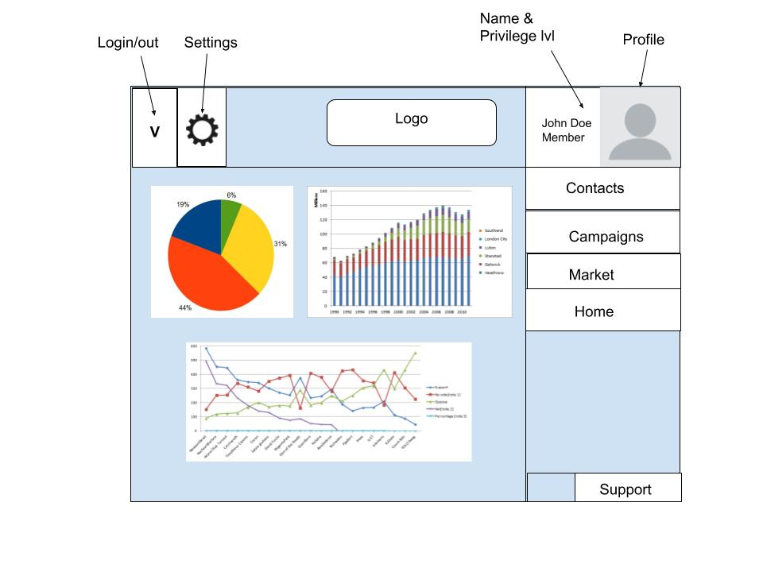

# Customer Relations Management Platform 

#### _CRM UI made with react, 2020 ver 1.0.0_

By Ian Gregg

## Description 

Basic Customer Relations Management (CRM) Platform built with react, that is non industry specific but can allow for future developers to add on more features or customize the platform itself. Features of the platform allow for user authentication with two levels of credentials, first is the member login and 2nd is the leadership login. Members have a finite view of the CRM set to only information they have entered while the leadership can see all information thats been entered and make edits.

**Concept design for the project:**

## Use Case

This would be geared to business leadership and sales folks. This would allow the leadership to see the projected health of the business and allow the team members to keep track of all the customer information for their book of business. This would be able to be a marketed product in the real world for various industries and allow for a basic framework to build off of later to hone into a specific company or vertical.

## Minimum Viable Product

* A database of contacts
  * input by a user

* Can see a projection of sales (pipeline)
  * Able to view the scope of the their entire book of business

* Interactive platform with various tabs for various views into the business as a admin or team member
  * Have a list of tabs for the vaious biews that the user can access.

## Tools for MVP

* React

* Google Draw

* Redux

* Sanity(API)

* FireBase

## Additional Features

* Fully stylized and unified theme
  * color sceme & layout is unifed but neutral enough to be changed to the developers specs.
* A user can set up a specified profile 
  * personalized picture
  * settings for emails 
  * offical title

* Have the email login with credentials
  * password protected authentification 
  * Password recovery system

* Member or leadership profile for the user to edit
  * Members have a limited view of the platform only showing their own imputs
  * Leadership have a full scope of the company can make changes for memebers.

## Tools for Additional Features

* Gatsby
* Contentful
* Netlify

## Features of the Application

This project was bootstrapped with [Create React App](https://github.com/facebook/create-react-app).

## Available Scripts

In the project directory, you can run:

### `npm start`

Runs the app in the development mode. 
Open [http://localhost:3000](http://localhost:3000) to view it in the browser.

The page will reload if you make edits. 
You will also see any lint errors in the console.

### `npm test`

Launches the test runner in the interactive watch mode. 
See the section about [running tests](https://facebook.github.io/create-react-app/docs/running-tests) for more information.

### `npm run build`

Builds the app for production to the `build` folder. 
It correctly bundles React in production mode and optimizes the build for the best performance.

The build is minified and the filenames include the hashes. 
Your app is ready to be deployed!

See the section about [deployment](https://facebook.github.io/create-react-app/docs/deployment) for more information.

### `npm run eject`

**Note: this is a one-way operation. Once you `eject`, you can’t go back!**

If you aren’t satisfied with the build tool and configuration choices, you can `eject` at any time. This command will remove the single build dependency from your project.

Instead, it will copy all the configuration files and the transitive dependencies (webpack, Babel, ESLint, etc) right into your project so you have full control over them. All of the commands except `eject` will still work, but they will point to the copied scripts so you can tweak them. At this point you’re on your own.

You don’t have to ever use `eject`. The curated feature set is suitable for small and middle deployments, and you shouldn’t feel obligated to use this feature. However we understand that this tool wouldn’t be useful if you couldn’t customize it when you are ready for it.

## Learn More

You can learn more in the [Create React App documentation](https://facebook.github.io/create-react-app/docs/getting-started).

To learn React, check out the [React documentation](https://reactjs.org/).

### Code Splitting

This section has moved here: https://facebook.github.io/create-react-app/docs/code-splitting

### Analyzing the Bundle Size

This section has moved here: https://facebook.github.io/create-react-app/docs/analyzing-the-bundle-size

### Making a Progressive Web App

This section has moved here: https://facebook.github.io/create-react-app/docs/making-a-progressive-web-app

### Advanced Configuration

This section has moved here: https://facebook.github.io/create-react-app/docs/advanced-configuration

### Deployment

This section has moved here: https://facebook.github.io/create-react-app/docs/deployment

### `npm run build` fails to minify

This section has moved here: https://facebook.github.io/create-react-app/docs/troubleshooting#npm-run-build-fails-to-minify

## Support 

* Ian Gregg <iangregg188@gmail.com>

## License

Copyright (c) 2020 **_Ian Gregg_**

Permission is hereby granted, free of charge, to any person obtaining a copy of this software and associated documentation files (the “Software”), to deal in the Software without restriction, including without limitation the rights to use, copy, modify, merge, publish, distribute, sublicense, and/or sell copies of the Software, and to permit persons to whom the Software is furnished to do so, subject to the following conditions:
The above copyright notice and this permission notice shall be included in all copies or substantial portions of the Software.
THE SOFTWARE IS PROVIDED “AS IS”, WITHOUT WARRANTY OF ANY KIND, EXPRESS OR IMPLIED, INCLUDING BUT NOT LIMITED TO THE WARRANTIES OF MERCHANTABILITY, FITNESS FOR A PARTICULAR PURPOSE AND NONINFRINGEMENT. IN NO EVENT SHALL THE AUTHORS OR COPYRIGHT HOLDERS BE LIABLE FOR ANY CLAIM, DAMAGES OR OTHER LIABILITY, WHETHER IN AN ACTION OF CONTRACT, TORT OR OTHERWISE, ARISING FROM, OUT OF OR IN CONNECTION WITH THE SOFTWARE OR THE USE OR OTHER DEALINGS IN THE SOFTWARE.

## Remember you can always reach out to the editors if this doesn't make sense.

